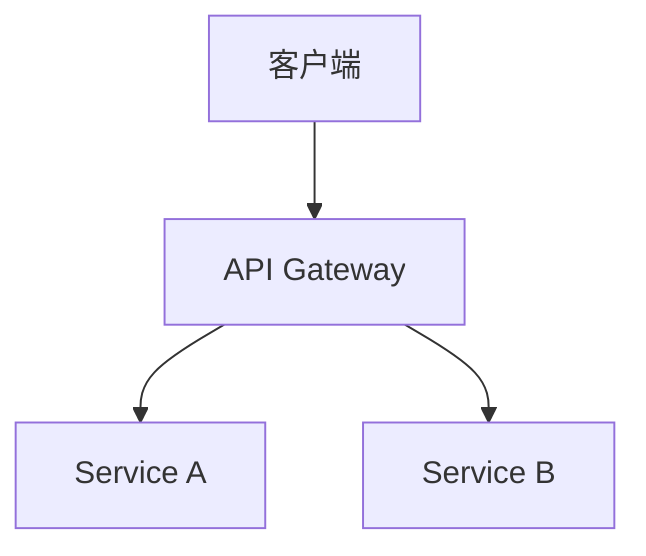
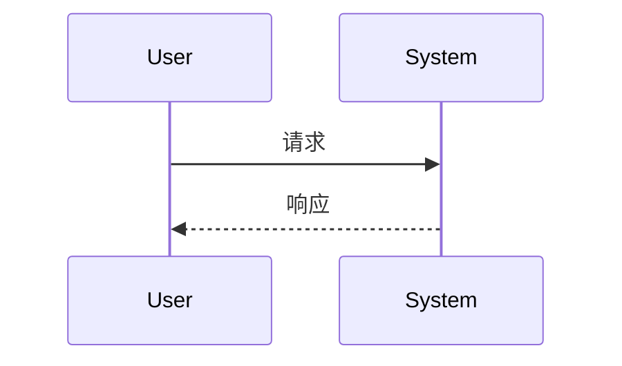

# Doc Coauthoring - 文档协同写作

结构化文档写作工作流，确保文档清晰、完整、对读者友好。

## 🎯 适用范围

**使用此技能**：
- ✅ 技术文档（API 文档、架构设计）
- ✅ 学术论文
- ✅ README / 项目文档
- ✅ 技术规格
- ✅ 决策文档（ADR）

**文档类型**：

| 类型 | 用途 | 模板 |
|------|------|------|
| API 文档 | 接口说明 | OpenAPI / Markdown |
| 架构文档 | 系统设计 | Arc42 |
| README | 项目介绍 | 标准结构 |
| 论文 | 学术发表 | IEEE / ACM |
| ADR | 架构决策记录 | MADR |

---

## 📋 协同写作流程

```
┌─────────────┐    ┌─────────────┐    ┌─────────────┐
│ 1. Structure│ -> │ 2. Draft    │ -> │ 3. Refine   │
│   确定结构  │    │   填充内容  │    │   迭代优化  │
└─────────────┘    └─────────────┘    └─────────────┘
       ↓                  ↓                  ↓
   章节大纲          初稿内容          润色完善
   目标读者          技术细节          语言优化
                     代码示例          格式统一
```

---

## 第一步：确定结构

### 根据文档类型选择结构

#### README 结构

```markdown
# [项目名称]

## 简介
一两句话描述项目

## 快速开始
安装和使用步骤

## 功能特性
主要功能列表

## 使用文档
详细使用说明

## API 文档
接口说明

## 贡献指南
如何参与贡献

## 许可证
开源协议
```

#### API 文档结构

```markdown
# API 文档

## 概述
- 基础 URL
- 认证方式
- 通用参数

## 端点列表

### POST /api/resource
**描述**: 创建资源

**请求**:
```json
{
  "name": "string",
  "value": "number"
}
```

**响应**: 201 Created
```json
{
  "id": "string",
  "createdAt": "timestamp"
}
```

**错误码**:
- 400: 参数错误
- 401: 未认证
- 409: 资源冲突
```

#### 技术规格结构

```markdown
# [Feature] 技术规格

## 背景
为什么需要这个功能

## 目标
功能目标和成功标准

## 需求
### 功能需求
### 非功能需求

## 设计方案
### 架构
### 数据模型
### API 设计

## 实施计划
### 阶段划分
### 时间估算

## 风险与缓解
```

---

## 第二步：填充内容

### 内容撰写原则

```bash
# ❌ 错误：模糊表述
"这个函数处理数据"
"优化性能"

# ✅ 正确：具体描述
"这个函数将 JSON 数据转换为 CSV 格式"
"通过添加缓存将响应时间从 200ms 降低到 50ms"
```

### 代码示例格式

````markdown
```javascript
// 不带注释的代码（简洁版）
function add(a, b) {
  return a + b;
}
```

```javascript
// 带注释的代码（教学版）
/**
 * 计算两个数的和
 * @param {number} a - 第一个数
 * @param {number} b - 第二个数
 * @returns {number} 和
 */
function add(a, b) {
  return a + b;
}
```
````

### 图表与可视化

```markdown
## 架构图



## 时序图


```

---

## 第三步：迭代优化

### 读者视角检查

**提问**：
- 如果我是新手，能看懂吗？
- 有哪些术语需要解释？
- 代码示例能直接运行吗？

### 语言优化

```bash
# 被动 → 主动
"数据被处理" → "函数处理数据"

# 模糊 → 具体
"很快" → "100ms 内"

# 冗长 → 简洁
"在这个阶段，我们需要做的是..." → "此阶段..."
```

### 格式统一

- 标题层级一致
- 代码风格统一
- 术语表意一致（如「用户」不混用「user」「使用者」「client」）

---

## 与 scholar-workflow 配合

```
scholar-workflow          doc-coauthoring
     ↓                          ↓
 搜索论文                    引用格式
 查阅文献                    参考文献列表
 验证来源                    交叉引用
     ↓                          ↓
 写论文 ←─────────────────────┘
```

---

## 常见触发场景

使用此技能时，你会听到：
- "写文档"
- "更新 README"
- "API 文档"
- "技术规格"
- "Write documentation"
- "Create docs"
