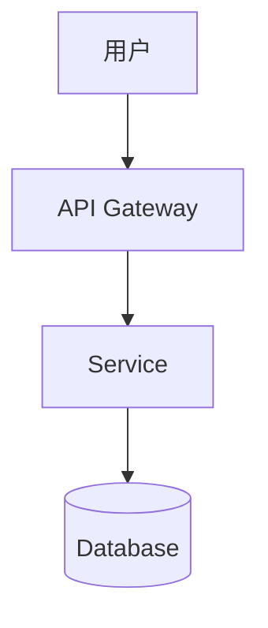

# Spec-Driven Development - 规格驱动开发

基于 GitHub Spec Kit 的规格驱动开发流程。分离规划与执行，减少上下文切换。

## 🎯 适用范围

**使用此技能**：
- ✅ 新功能开发前的系统化规划
- ✅ 需要明确的规格文档
- ✅ 复杂项目的任务分解
- ✅ 团队协作需要统一文档

**何时不用**：
- ❌ 快速原型开发
- ❌ 简单 bug 修复
- ❌ 探索性编程

---

## 📋 SDD 四步流程

```
┌─────────────┐    ┌─────────────┐    ┌─────────────┐    ┌─────────────┐
│  1. Spec    │ -> │  2. Plan    │ -> │  3. Tasks   │ -> │  4. Implement│
│  需求规格   │    │  技术计划   │    │  任务分解   │    │  执行实现   │
└─────────────┘    └─────────────┘    └─────────────┘    └─────────────┘
     ↓                  ↓                  ↓                  ↓
  用户故事          技术选型          可执行任务          代码实现
  功能需求          架构设计          依赖关系          测试验证
  验收标准          数据契约          优先级            代码审查
```

---

## 第一步：创建规格（Spec）

### 规格文档结构

```markdown
# [Feature Name] - Specification

## Overview
简要描述功能目标和价值

## User Stories
作为 [角色]，我想要 [功能]，以便 [价值]

## Functional Requirements
### FR-001: [需求标题]
- **描述**: 详细描述
- **验收标准**: Given/When/Then 格式
- **优先级**: P0/P1/P2

## Non-Functional Requirements
- 性能要求
- 安全要求
- 可维护性要求

## Review Checklist
- [ ] 需求完整
- [ ] 验收标准明确
- [ ] 无歧义
```

### 规格编写原则

```bash
# ❌ 错误：模糊需求
"用户可以登录"

# ✅ 正确：EARS 格式
"作为注册用户，我想要用邮箱和密码登录，以便访问我的账户"
```

**EARS 格式**：
- **E**vent: 当...时
- **A**ction: 系统...
- **R**esponse: 返回...
- **S**ystem: 在...条件下

---

## 第二步：技术计划（Plan）

### 计划文档结构

```markdown
# [Feature Name] - Technical Plan

## Technology Stack
- 前端: [框架/版本]
- 后端: [框架/版本]
- 数据库: [类型/版本]
- 第三方服务: [API/版本]

## Architecture


## Data Contracts
### API Endpoints
- `POST /api/resource` - 创建资源
  - Request: { ... }
  - Response: { ... }

### Database Schema
```sql
CREATE TABLE ...
```

## Error Handling
- 错误码定义
- 重试策略
- 降级方案

## Security Considerations
- 认证方式
- 数据加密
- 输入验证
```

---

## 第三步：任务分解（Tasks）

### 任务文档结构

```markdown
# [Feature Name] - Implementation Tasks

## Phase 1: Foundation
- [ ] **T-001**: 设置项目基础结构
  - 依赖: 无
  - 估时: 2h
  - 验收: npm install 成功

- [ ] **T-002**: 配置数据库连接
  - 依赖: T-001
  - 估时: 1h
  - 验收: 连接测试通过

## Phase 2: Core Features
- [ ] **T-003**: 实现 API endpoint
  - 依赖: T-002
  - 估时: 4h
  - 验收: 集成测试通过

## Dependencies Graph
```
T-001 → T-002 → T-003
```

## Definition of Done
- [ ] 代码审查通过
- [ ] 单元测试覆盖率 >80%
- [ ] 集成测试通过
- [ ] 文档更新
```

---

## 第四步：执行实现

### 实现原则

```bash
# 按任务顺序执行
# 遵循依赖关系
# 每个 task 完成后验证
```

### 验证流程

```bash
# 1. 单元测试
npm test -- task-name.test

# 2. 集成测试
npm run test:integration

# 3. 代码审查
# 提交 PR，对照规格验收

# 4. 文档更新
# 更新 README、API 文档
```

---

## 与 tdd-workflow 配合

```
spec-driven-development     tdd-workflow
       ↓                          ↓
   定义规格                    写测试（红）
       ↓                          ↓
   技术计划                    让测试通过（绿）
       ↓                          ↓
   任务分解                    重构代码
       ↓                          ↓
   执行实现 ←───────────────────┘
```

---

## 命令参考

```bash
# 初始化 SDD 项目（使用 GitHub Spec Kit）
npx spec-kit init

# 创建新规格
npx spec-kit spec "Feature description"

# 生成技术计划
npx spec-kit plan

# 生成任务列表
npx spec-kit tasks
```

---

## 常见触发场景

使用此技能时，你会听到：
- "创建一个新功能的规格"
- "先规划一下这个项目"
- "需要需求分析"
- "分解任务"
- "SDD"
- "Spec-driven development"
- "Write a spec for..."
- "Break down this feature"
